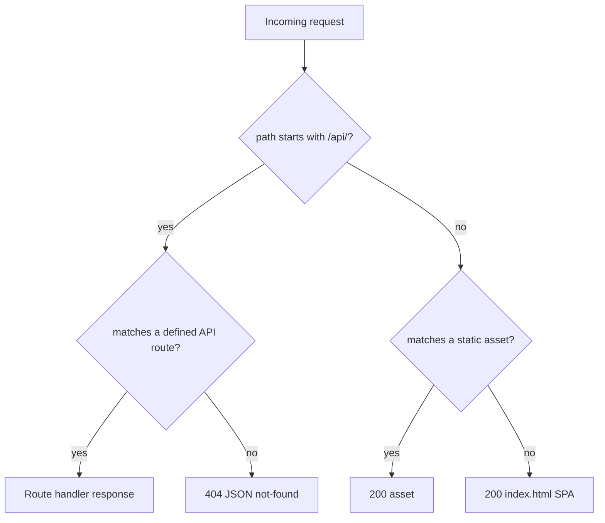
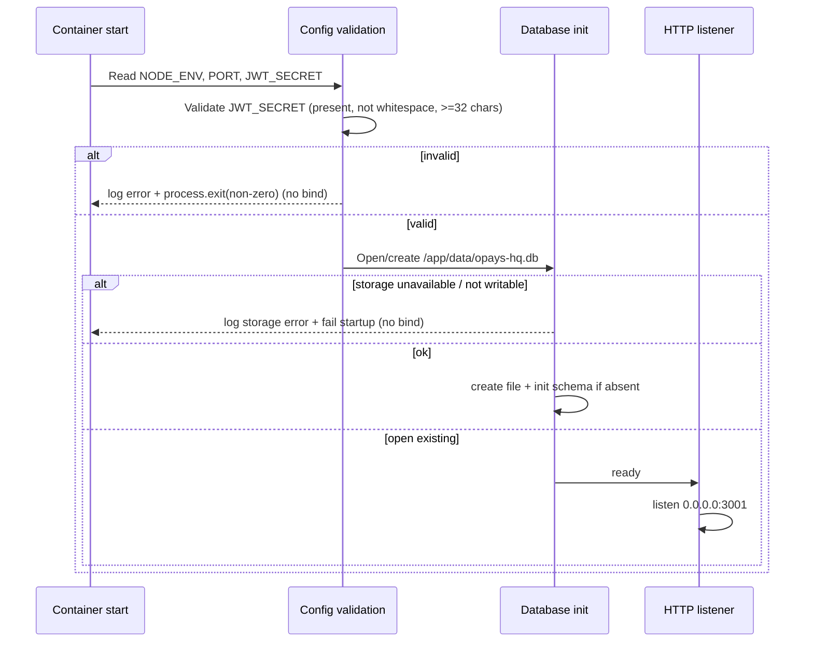

# Design Document

## Overview

This design describes how the Opays HQ application is deployed to a Dokploy-managed host and the application-side changes required to make that deployment correct, secure, and durable.

Opays HQ is a single-container, full-stack application. One Express 5 process (started with `tsx`) listens on port 3001 and serves both the compiled React/TanStack Router SPA and the JSON API. Persistence is a `better-sqlite3` file on a durable host volume.

The design splits cleanly into two layers:

1. **Platform layer (Dokploy)** — building the image from the `Dockerfile`, injecting environment variables and the `JWT_SECRET` secret, mounting the durable volume, terminating TLS for `hq.opays.io`, polling the health check, performing health-gated zero-downtime cutover, and supporting rollback. Most of this is Dokploy/Traefik behavior configured through the dashboard, with `dokploy.yml` acting as the canonical, version-controlled record of that configuration.

2. **Application layer (this codebase)** — four concrete changes needed so the container behaves correctly under Dokploy:
   - **Fail-fast configuration validation** of `JWT_SECRET` at startup (presence + minimum length), removing the insecure hardcoded fallback.
   - **A durable, explicit SQLite path** under `/app/data` with startup storage-failure handling.
   - **Correct request routing** so unmatched `/api/*` requests return a JSON 404 instead of the SPA document.
   - **A formalized `/api/health` contract** consumed by the platform health check.

The design also resolves two repository inconsistencies: the standalone `nginx.conf` is explicitly **not** part of the runtime, and the deployment config file `doploy.yml` should be renamed to `dokploy.yml` and have its build/runtime assumptions corrected (notably that `tsx` must be present at runtime).

### Research notes

- **Dokploy configuration model.** Dokploy configures Dockerfile "Application" deployments through its dashboard and Git provider integration (build path, port, domains, env vars, volumes, health check), and uses **Traefik** as the reverse proxy with **Let's Encrypt** for automatic TLS. Dokploy does **not** auto-detect a repository-level `dokploy.yml` for a Dockerfile Application the way it consumes a `docker-compose.yml` for Compose deployments. (Source: Dokploy docs — [Docker Compose](https://docs.dokploy.com/docs/core/docker-compose), [Going Production](https://docs.dokploy.com/docs/core/applications/going-production). Content rephrased for compliance with licensing restrictions.)
  - **Implication:** `dokploy.yml` is the authoritative, human-readable source-of-truth that the Deployment_Operator transcribes into the Dokploy dashboard (or maps to a Compose service). Renaming `doploy.yml` → `dokploy.yml` is for correctness and clarity; neither name is auto-loaded for a Dockerfile Application. The design treats every platform acceptance criterion as "configured in Dokploy to match `dokploy.yml`."
- **Zero-downtime + rollback** are provided by Dokploy's deploy pipeline and Traefik routing: a new container is started and health-gated before traffic is switched, and prior images can be redeployed for rollback. These are platform guarantees verified by integration/smoke checks, not by application unit tests.

## Architecture

```mermaid
graph TD
    User[End User / Operator] -->|HTTPS hq.opays.io| Traefik[Traefik Reverse Proxy<br/>TLS termination + ACME]
    Traefik -->|HTTP :3001 host-matched| Container[Opays HQ Container]

    subgraph Dokploy Platform
        Builder[Image Builder<br/>Dockerfile multi-stage]
        Health[Health Checker<br/>GET /api/health every 30s]
        Secrets[Secrets / Env Store<br/>NODE_ENV, PORT, JWT_SECRET]
        Volume[(Data Volume<br/>/data/opays-hq)]
        Traefik
    end

    Builder -->|produces| Container
    Secrets -->|injects env| Container
    Health -->|polls| Container
    Volume -->|mounted at /app/data| Container

    subgraph Container Single Express Process :3001
        Validate[Startup config validation<br/>JWT_SECRET present + len>=32]
        Routes[/api/* route handlers/]
        ApiNotFound[/api/* unmatched -> JSON 404/]
        Static[Static assets from /app/dist]
        SPA[SPA fallback index.html]
        DB[(better-sqlite3<br/>/app/data/opays-hq.db)]
    end

    Container --> Validate
    Validate --> Routes
    Routes --> ApiNotFound
    Container --> Static
    Static --> SPA
    Routes --> DB
```



### Request flow inside the container

The middleware order is the heart of Requirement 2. Requests are evaluated in this strict order:

1. **JSON body parsing + CORS** (existing middleware).
2. **API routers** mounted under `/api/...` (`/api/auth`, `/api/projects`, `/api/tasks`, `/api/treasury`, `/api/users`, `/api/knowledge`, `/api/dashboard`) plus `GET /api/health`.
3. **API 404 guard** — a handler scoped to `/api/*` that returns `404 application/json` for any unmatched API path. This must run *after* the API routers but *before* the static/SPA fallback so unmatched API calls never receive the SPA HTML.
4. **Static asset serving** from the built `dist` directory.
5. **SPA fallback** — any remaining non-API request returns `index.html` with status 200.



### Startup sequence



The critical ordering rule: **validation and database initialization must complete before `app.listen` binds port 3001.** Today `server/index.ts` calls `seedDefaultUsers()` (which opens the DB) before listening, but it never validates `JWT_SECRET` and binds unconditionally. The redesign inserts an explicit validation step ahead of any binding.

## Components and Interfaces

### Component 1: Startup configuration validator (`server/config.ts`, new)

A small, pure-logic module that reads and validates environment configuration before the server binds.

```typescript
export interface AppConfig {
  nodeEnv: string;
  port: number;
  jwtSecret: string;
}

export type ConfigError =
  | { kind: 'JWT_SECRET_MISSING' }       // empty, undefined, or whitespace-only
  | { kind: 'JWT_SECRET_TOO_SHORT'; length: number }; // < 32 chars

// Pure: no process.exit, no logging — returns a result so it is unit/property testable.
export function validateJwtSecret(raw: string | undefined):
  | { ok: true; value: string }
  | { ok: false; error: ConfigError };

// Thin imperative wrapper used by index.ts: logs + process.exit(1) on failure.
export function loadConfigOrExit(env: NodeJS.ProcessEnv): AppConfig;
```

Validation rules (Requirement 3.4, 3.6):
- `undefined`, empty string, or a value that is only whitespace → `JWT_SECRET_MISSING`.
- A value whose length is `< 32` → `JWT_SECRET_TOO_SHORT`.
- Otherwise valid.

The minimum-length check is evaluated on the raw provided value (length `>= 32`). The missing/whitespace check takes precedence: a whitespace-only string is reported as missing rather than too-short. On any failure, `loadConfigOrExit` writes a descriptive error log and calls `process.exit(1)` so the container never binds port 3001.

### Component 2: Auth secret consumption (`server/auth.ts`, modified)

Remove the insecure fallback `process.env.JWT_SECRET || 'opays-hq-secret-change-in-production'`. The secret is read from the validated config produced at startup. Because validation guarantees a valid secret before binding, `auth.ts` can safely read `process.env.JWT_SECRET` (now guaranteed present) or receive the value from the config module. Token signing and verification behavior are otherwise unchanged.

### Component 3: Database path + storage initialization (`server/db.ts`, modified)

- The database path becomes an explicit, environment-overridable absolute path with a production default of `/app/data/opays-hq.db`. A `DATA_DIR` environment variable (default `/app/data`) determines the directory; the file name remains `opays-hq.db`.
- Startup behavior:
  - If `/app/data` is absent, attempt to create it. If creation or opening the database fails because the directory is absent or not writable, emit a storage-failure log identifying the path and fail startup (Requirement 5.5).
  - If the database file does not exist, create it and initialize the schema before serving requests (Requirement 5.4).
  - If the database file already exists, open it; schema creation uses `CREATE TABLE IF NOT EXISTS` and role seeding is guarded by a row-count check, so existing data is never overwritten or re-initialized (Requirement 5.7).
- WAL journal mode is retained; committed transactions are flushed to the volume so they survive restart/redeploy (Requirement 5.8).

### Component 4: HTTP routing (`server/index.ts`, modified)

Reorder and add middleware to satisfy Requirement 2:

```typescript
// ... API routers mounted under /api/* ...
app.get('/api/health', healthHandler);

// NEW: API 404 guard — must come after API routers, before static/SPA.
app.use('/api', (_req, res) => {
  res.status(404).json({ error: 'Not found' });
});

// Static assets
app.use(express.static(distPath));

// SPA fallback — only reached for non-API paths
app.use((_req, res) => {
  res.sendFile(path.join(distPath, 'index.html'));
});
```

The `loadConfigOrExit` call and database readiness are placed before `app.listen(PORT, '0.0.0.0', ...)`.

### Component 5: Health endpoint (`server/index.ts`, formalized)

```
GET /api/health  ->  200 OK
Content-Type: application/json
{ "status": "ok", "timestamp": "<ISO-8601>" }
```

`res.json(...)` sets `Content-Type: application/json` and status 200 by default, so the existing handler already satisfies Requirement 4.1. The contract is formalized here so the Dokploy health check (path `/api/health`, interval 30s, timeout 10s, retries 3) has a stable target.

### Component 6: Container image (`Dockerfile`, modified) and build context (`.dockerignore`, new)

Issues in the current Dockerfile and their resolutions:

| Issue | Resolution |
|------|-----------|
| Runtime `CMD ["npx","tsx","server/index.ts"]` but `tsx` is a `devDependency` removed by `npm ci --omit=dev`, so the container would try to fetch `tsx` over the network at boot (threatens 60s readiness, Req 1.3). | Ensure `tsx` is present in the production image — either move `tsx` to `dependencies`, or install it explicitly in the production stage (`npm i -g tsx` / dedicated install). The image must run with no network fetch at startup. |
| `npx tsc --project tsconfig.server.json \|\| true` references a non-existent `tsconfig.server.json` (silent no-op) and the `dist-server` copy is vestigial since the runtime uses `tsx` directly. | Remove the dead backend-compile stage and `dist-server` copy; keep the `tsx`-based runtime which matches the requirements. |
| No `.dockerignore`, so `COPY . .` pulls `node_modules`, `dist`, `data`, `.git`, `.kiro`, etc. into the build context (slow, risks copying a local SQLite DB into the image). | Add `.dockerignore` excluding `node_modules`, `dist`, `dist-server`, `data`, `*.db*`, `.git`, `.kiro`, `.env*`, `nginx.conf`. |
| `nginx.conf` present in repo could imply a static server. | Excluded from the image via `.dockerignore`; documented as not part of the runtime (Req 2.7). |

The image continues to: build the SPA with Vite (stage 1), install production dependencies with native `better-sqlite3` build tools then remove them (stage 3), copy `dist` and `server/`, create `/app/data`, expose 3001, set `NODE_ENV=production` and `PORT=3001`, and launch the single Express process. Because the working directory is `/app`, the default SQLite path resolves under `/app/data`.

### Component 7: Deployment configuration (`dokploy.yml`, renamed from `doploy.yml`)

Rename `doploy.yml` → `dokploy.yml` (corrects the typo). The file remains the canonical record the operator applies in the Dokploy dashboard:

- **app/build:** type `dockerfile`, build from `Dockerfile`, container port `3001`.
- **health check:** path `/api/health`, interval 30s, timeout 10s, retries 3.
- **domains:** `hq.opays.io` with TLS enabled (Traefik + Let's Encrypt), HTTP→HTTPS redirect.
- **environment:** `NODE_ENV=production`, `PORT=3001`, `JWT_SECRET=${JWT_SECRET}` (variable substitution; the secret value is stored as a Dokploy secret, never committed — Req 3.5).
- **volumes:** `/data/opays-hq:/app/data` (read-write).

Because Dokploy does not auto-load this file for a Dockerfile Application, the design documents the field-by-field mapping into the dashboard and treats the dashboard state as authoritative at runtime.

### Component 8: Platform routing, TLS, deploy/rollback (Dokploy/Traefik configuration)

Configured in Dokploy, not in application code:
- Host-based routing: requests with `Host: hq.opays.io` route to the container on 3001; non-matching hosts are rejected (Req 6.1, 6.6).
- TLS termination at Traefik with an ACME-issued, publicly trusted certificate for `hq.opays.io`; failed handshakes are closed without forwarding; HTTP is permanently redirected to HTTPS preserving host/path/query (Req 6.2–6.5).
- Health-gated zero-downtime cutover and rollback to a prior image (Req 7), build failure isolation and timeout (Req 1.4–1.6), volume mount-failure abort (Req 5.2), and deployment outcome reporting (Req 8.1–8.2).

## Data Models

### AppConfig (in-memory, startup)

| Field | Type | Source | Notes |
|------|------|--------|-------|
| `nodeEnv` | string | `NODE_ENV` | Expected `production` in deployment |
| `port` | number | `PORT` | Default `3001` |
| `jwtSecret` | string | `JWT_SECRET` (secret) | Validated: non-whitespace, length ≥ 32 |

### ConfigError (validation result)

| Variant | Trigger | Operator-visible effect |
|--------|---------|------------------------|
| `JWT_SECRET_MISSING` | undefined / empty / whitespace-only | Error log "JWT secret is missing"; exit non-zero; no bind |
| `JWT_SECRET_TOO_SHORT` | length < 32 | Error log "JWT secret does not meet minimum length"; exit non-zero; no bind |

### Health response

| Field | Type | Value |
|------|------|-------|
| `status` | string | `"ok"` |
| `timestamp` | string | ISO-8601 timestamp |

### SQLite database (on Data_Volume)

- **Location:** `/app/data/opays-hq.db` (plus `-wal`/`-shm` WAL sidecar files).
- **Schema:** existing tables — `roles`, `users`, `projects`, `tasks`, `task_comments`, `agent_configs`, `agent_conversations`, `knowledge_articles`, `treasury_logs`, `equity_logs` (created with `CREATE TABLE IF NOT EXISTS`).
- **Lifecycle:** created + seeded with roles/default users only when empty; otherwise opened in place. Persisted across container replacement because the same host volume `/data/opays-hq` is re-attached.

### HTTP path classification (routing model)

| Input path | Match condition | Result |
|-----------|-----------------|--------|
| `/api/<route>` | matches a mounted API route | handler response |
| `/api/<unmatched>` | no API route matches | `404 application/json` |
| `/<asset>` | exists in `dist` | `200` asset |
| `/<anything else>` | not an asset, not `/api/*` | `200 index.html` |
